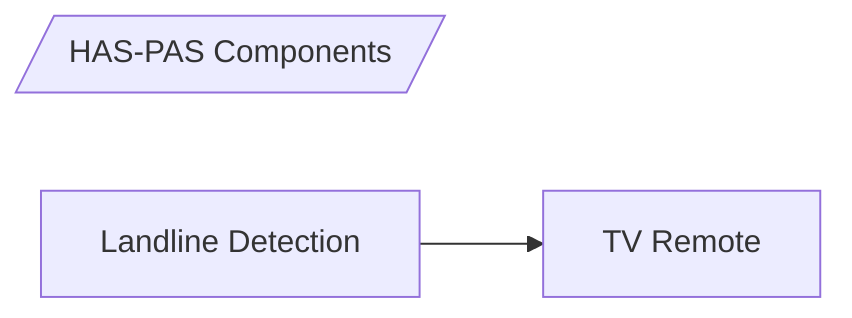
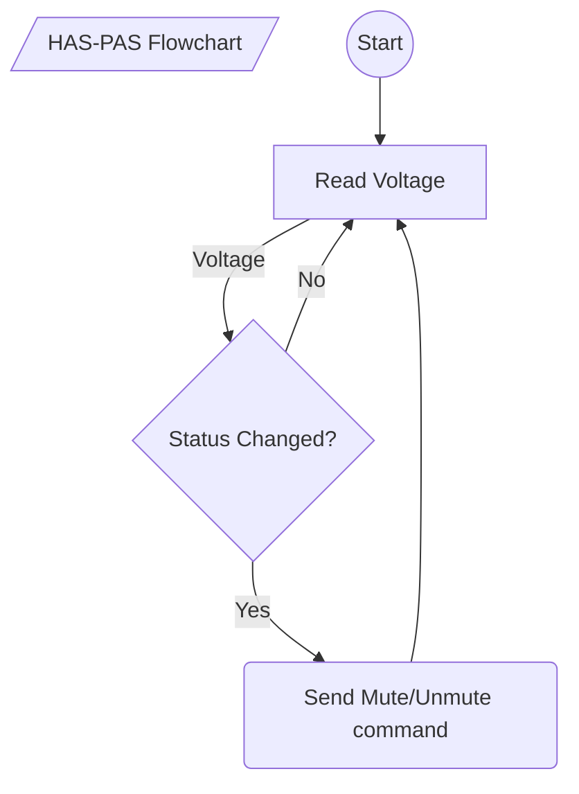

# HAS-PAS System

## What is it?
HAS-PAS is a simple automation system for putting the TV on mute while the landline is in-use. 
 Or, simply: 
1. :telephone_receiver: &nbsp;&nbsp;&nbsp;&nbsp;&nbsp;&nbsp;&nbsp;&nbsp; :arrow_right: &nbsp;&nbsp; :mute: :tv:
2. :telephone_receiver: :x: &nbsp;&nbsp; :arrow_right: &nbsp;&nbsp; :loud_sound: :tv:

(Originally named by my uncle, HAS=quite ,PAS=line (Hebrew-named))

## Some Background
It was invented as an automation solution for my grandfather :older_man: (passed away 1 year ago during COVID19 - R.I.P) - which couldn't hear well, as a result of his age.
Usually he turned up his TV volume to its (almost) maximum level, so it was impossible to have a phone-call conversation without **S-H-O-U-T-I-N-G** :mega:.

We tried several solutions:
1. Obviously - brining the wireless telephone much closer to him.
2. Wireless headphones (which caused him to completely ignore the telephone rings, and battery charging uses as well).
3. LED indicator on the phone that flashes when the phone rings (completely useless when the phone is not near).

## How It Works?

### High-level view 
HAS-PAS is built by two separate components:

 1. Land-line in-use detection circuit 
 2. Arduino TV Remote emitter

The output of (1) is used as an input of (2).

### Flowchart

# BOM

 1. Arduino Uno.
 2. 4 Diodes (or diodes-bridge)
 3. 2 Transistors - *2N3392* 
 4. 4 Resistors - *3.3K, 22K, 68K, 18K, 5.6K*
 5. 2 LEDs

# Putting It All Together
## HW
Soldering the Phone-In-Use circuit is quite simple, I've also added a fuse to protect my landline port.
[I found this circuit somewhere in Google and I can't find its original page now.. so *credit-to-someone-out-there*] 

## SW
Using Arduino's [IRremote](https://www.arduino.cc/reference/en/libraries/irremote/) package makes it very simple to implement, all I had to do is to locate my grandfather's LG code from the manuals and throw some logic into my code to overcome the voltage spikes caused by my telephone company, leading to "double-mute" situation in case a real phone-call comes in.

## 3D Box
Because we can't really have all this hardware in the middle of the living room without any box to hide it..

## Installation
Installing the system only requires to place the IR LED somewhere in front of the TV (but high enough so no one could block the signal) and connect the Arduino to 5V charger. That's all.

# Alternative

There is another alternative though, in case of LG TV.
LG works with WebOS which enables REST API that can be used with this project [LGTV2](https://github.com/hobbyquaker/lgtv2) but it requires RPi for running Node.js and I think that Arduino is doing a great job here.
